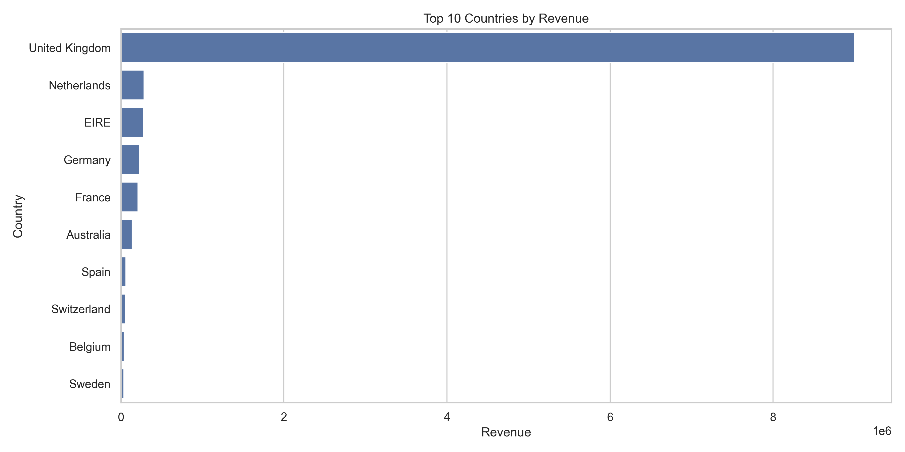
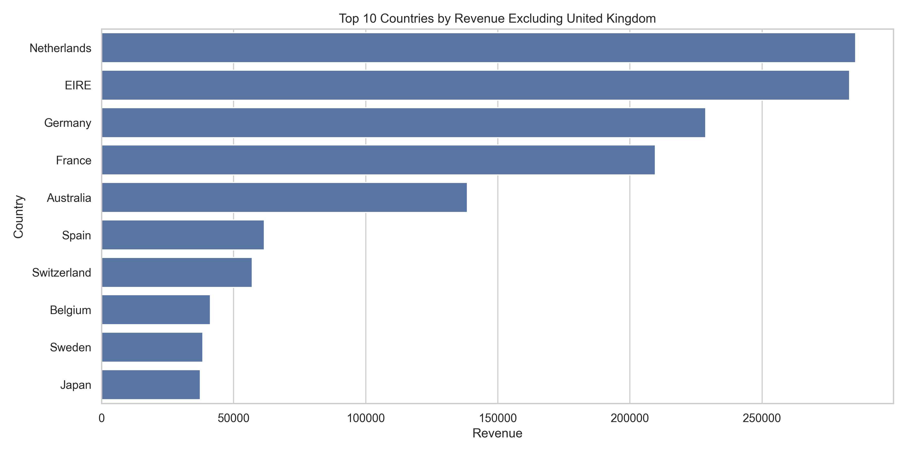
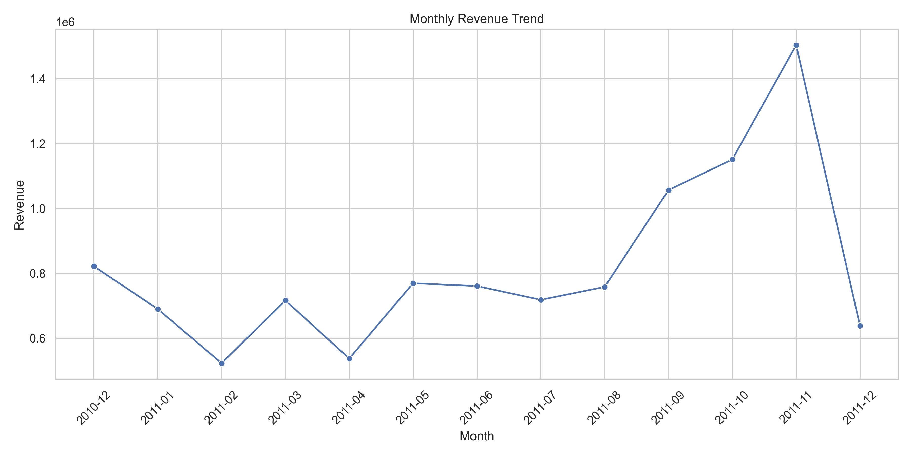
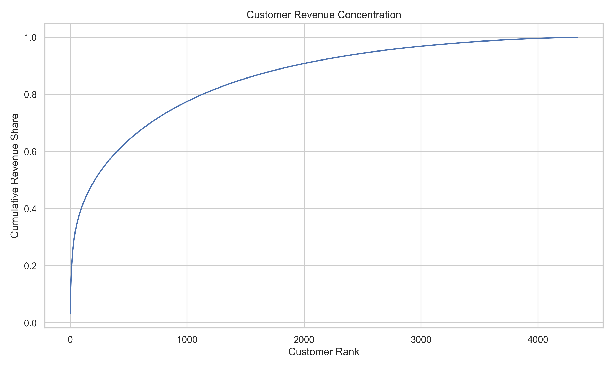
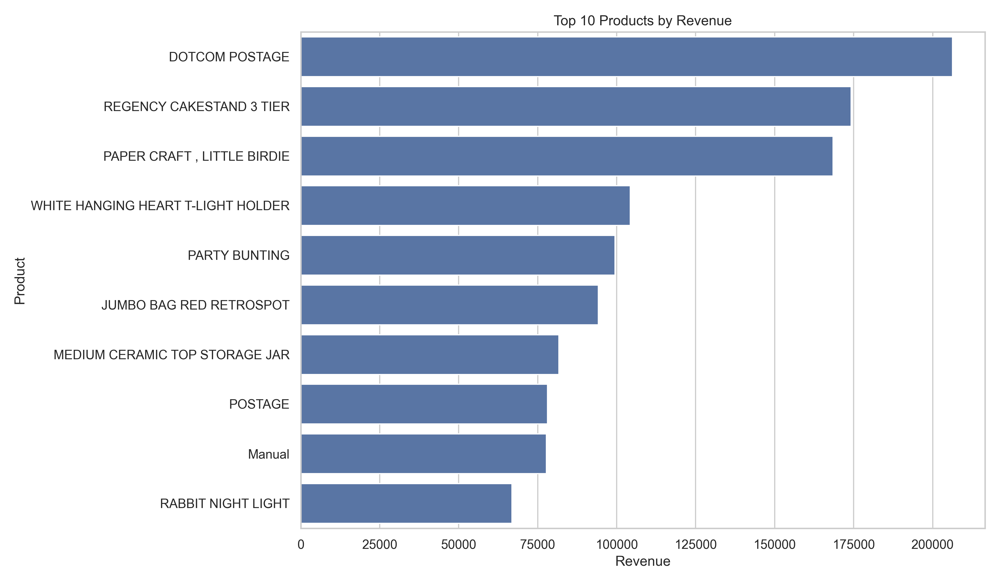
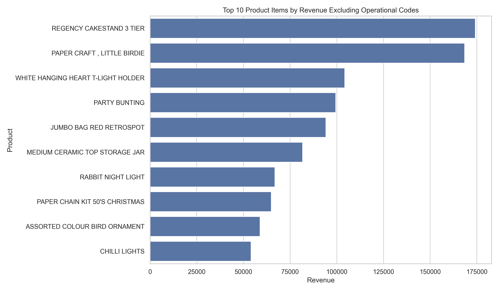
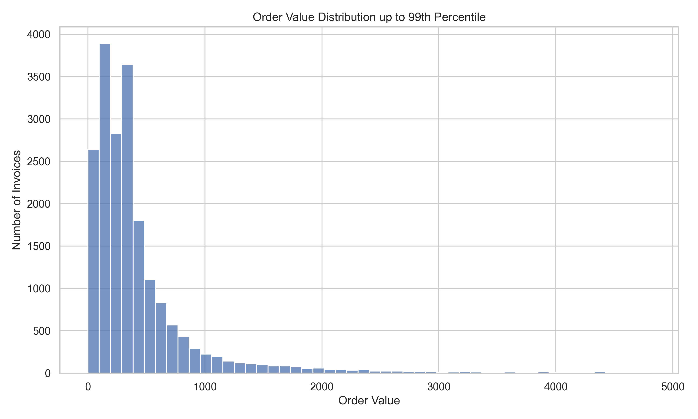

# Retail Sales Intelligence: Exploratory Data Analysis for Business Decisions

## Overview

This project analyzes online retail transaction data to identify revenue patterns, customer behavior, product performance, cancellation impact, and business opportunities.

The goal is to transform raw transactional data into useful business insights before building predictive models, dashboards, or customer segmentation systems.

---

## Business Context

Retail companies need to understand their sales behavior before making decisions about pricing, inventory, marketing, customer retention, international expansion, and operational improvement.

This project focuses on exploratory data analysis as the foundation for future machine learning and business intelligence projects.

---

## Dataset

This project uses the **Online Retail** dataset from the UCI Machine Learning Repository.

The dataset contains transactional data from a UK-based online retail company between December 2010 and December 2011.

Main variables include:

- `InvoiceNo`: transaction identifier.
- `StockCode`: product identifier.
- `Description`: product description.
- `Quantity`: number of items purchased.
- `InvoiceDate`: transaction date and time.
- `UnitPrice`: product unit price.
- `CustomerID`: customer identifier.
- `Country`: customer country.

Invoices starting with `C` represent cancellations.

---

## Project Structure

```text
retail-sales-eda/
├── data/
│   ├── raw/
│   └── processed/
├── notebooks/
│   └── 01_exploratory_analysis.ipynb
├── src/
│   ├── audit_data.py
│   ├── clean_data.py
│   ├── load_data.py
│   └── validate_data.py
├── reports/
│   ├── executive_summary_en.md
│   ├── resumen_ejecutivo_es.md
│   └── figures/
├── README.md
├── requirements.txt
└── .gitignore
```

---

## Methodology

The project follows a reproducible workflow:

1. Download raw data.
2. Audit data quality.
3. Clean and enrich the dataset.
4. Create valid sales and customer-level datasets.
5. Validate processed data using business rules.
6. Perform exploratory data analysis.
7. Generate business insights and recommendations.

---

## Data Processing Summary

Three datasets were created:

| Dataset | Rows | Purpose |
|---|---:|---|
| Clean data | 536,641 | Full enriched dataset with business flags |
| Valid sales | 524,878 | Main dataset for revenue, products, countries, and time trends |
| Customer sales | 392,692 | Subset for customer-level analysis |

Valid sales revenue reached **10.64M**.

Customer-identified revenue reached **8.89M**, meaning that **16.49%** of valid revenue cannot be linked to a known customer.

---

## Key Findings

### 1. Revenue is highly concentrated in the United Kingdom

The United Kingdom represents approximately **85%** of valid sales revenue.

This indicates strong dependence on the domestic market. International markets should be analyzed separately because smaller markets can be hidden by the dominance of the UK.





---

### 2. Revenue increased strongly before December 2011

Revenue grew strongly between September and November 2011.

However, December 2011 is incomplete because the dataset only includes transactions up to December 9. Therefore, December should not be compared directly with full months.



---

### 3. Customer revenue is meaningfully concentrated

The top 10 identified customers generate **17.30%** of customer-identified revenue.

The top 100 identified customers generate **40.61%** of customer-identified revenue and approximately **33.91%** of total valid sales revenue.



---

### 4. Product ranking requires business interpretation

Some high-revenue records are not regular product items. Examples include postage, manual adjustments, and operational codes.

For this reason, product performance was analyzed both with and without special operational codes.





---

### 5. Cancellations have a material impact

Cancellations represent a negative revenue impact of approximately **894K**, equivalent to **8.40%** of valid sales revenue.

This should be investigated as a business and operational issue, not discarded as simple noise.

---

### 6. Order values are highly skewed

The average order value is **533.17**, while the median order value is **303.30**.

This means that a small number of large orders distort average-based interpretations. Median and percentile-based metrics are more reliable for understanding typical order behavior.



---

## Business Recommendations

1. Monitor high-value customers separately because they represent a significant share of customer-identified revenue.
2. Analyze international markets excluding the United Kingdom to identify opportunities hidden by the dominant domestic market.
3. Investigate cancellation patterns by product, country, and customer to identify operational friction.
4. Separate operational codes from product rankings to avoid confusing charges or adjustments with merchandise performance.
5. Use median and percentile-based metrics for order value analysis instead of relying only on averages.
6. Treat missing customer identifiers as a data quality limitation before performing customer segmentation or retention analysis.

---

## Reports

- [Executive Summary — English](reports/executive_summary_en.md)
- [Resumen Ejecutivo — Español](reports/resumen_ejecutivo_es.md)

---

## Notebook

- [Exploratory Analysis Notebook](notebooks/01_exploratory_analysis.ipynb)

---

## How to Reproduce This Project

### 1. Clone the repository

```bash
git clone https://github.com/RommelPa/retail-sales-eda.git
cd retail-sales-eda
```

### 2. Create and activate a virtual environment

```bash
py -m venv .venv
.venv\Scripts\activate
```

### 3. Install dependencies

```bash
pip install -r requirements.txt
```

### 4. Download the raw dataset

```bash
python src/load_data.py
```

### 5. Audit the raw data

```bash
python src/audit_data.py
```

### 6. Clean and process the data

```bash
python src/clean_data.py
```

### 7. Validate processed datasets

```bash
python src/validate_data.py
```

### 8. Open the notebook

```bash
jupyter notebook notebooks/01_exploratory_analysis.ipynb
```

---

## Tools Used

- Python
- pandas
- numpy
- matplotlib
- seaborn
- Jupyter Notebook
- Git
- GitHub

---

## Limitations

- The dataset covers transactions from December 2010 to December 2011 only.
- December 2011 is incomplete and should not be compared directly with full months.
- Around 16.49% of valid sales revenue has no associated customer identifier.
- The dataset does not include product cost, profit margin, marketing spend, inventory levels, or customer demographics.
- Some high-revenue records may represent operational adjustments instead of regular product sales.

---

## Next Steps

This project can be extended into:

- Customer segmentation using clustering.
- Sales forecasting using time series methods.
- Executive dashboard in Power BI or Tableau.
- Cancellation analysis by product, country, and customer.
- Customer lifetime value analysis.

---

## Spanish Summary

Este proyecto analiza datos transaccionales de ventas online para identificar patrones de ingresos, comportamiento de clientes, desempeño de productos, impacto de cancelaciones y oportunidades comerciales.

El análisis muestra una fuerte concentración de ingresos en Reino Unido, una dependencia relevante de clientes de alto valor, un impacto material de cancelaciones y limitaciones importantes por ventas sin identificador de cliente.

El objetivo es construir una base sólida para futuros proyectos de segmentación, forecasting, dashboards ejecutivos y modelos predictivos.